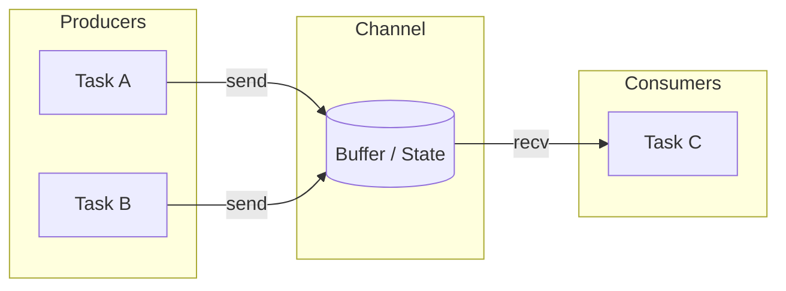
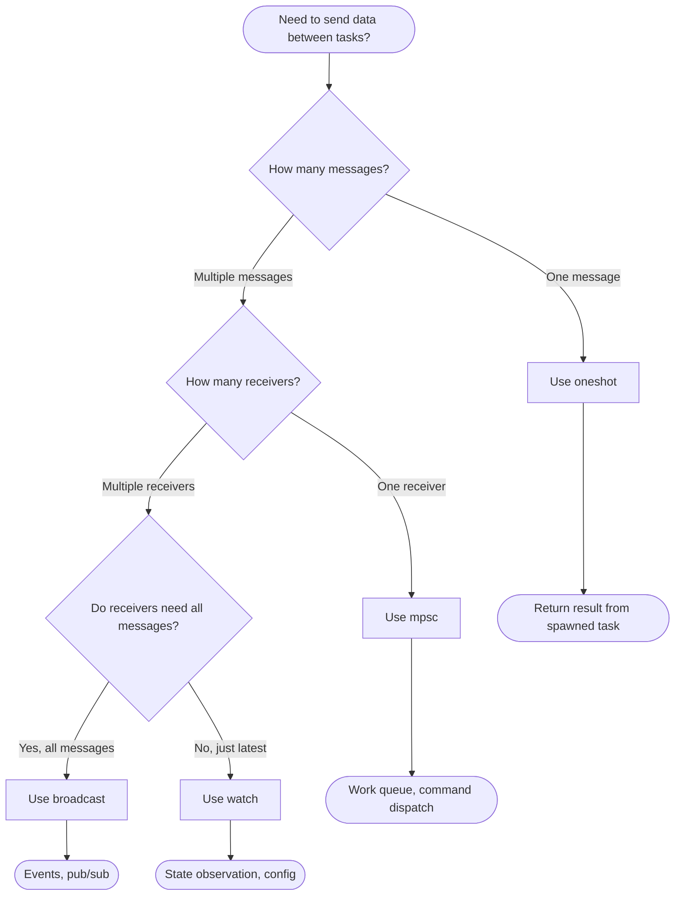

# Tokio Channels: A Comprehensive Guide

This guide covers Tokio's channel primitives for async communication in Rust. By the end, you'll understand when and how to use each channel type effectively.

## Table of Contents

1. [Introduction](#introduction)
2. [Channel Types Overview](#channel-types-overview)
3. [mpsc - Multi-Producer, Single-Consumer](#mpsc---multi-producer-single-consumer)
4. [oneshot - Single Value, Single Use](#oneshot---single-value-single-use)
5. [broadcast - Multi-Producer, Multi-Consumer](#broadcast---multi-producer-multi-consumer)
6. [watch - Single Value Observable](#watch---single-value-observable)
7. [Advanced Patterns](#advanced-patterns)
8. [Summary & Decision Guide](#summary--decision-guide)

---

## Introduction

### What Are Channels?

Channels are communication primitives that allow different parts of your async program to exchange data safely. They implement the **producer-consumer pattern**: one or more producers send data, and one or more consumers receive it.

In synchronous Rust, you might use `std::sync::mpsc`. In async Tokio, we use `tokio::sync` channels which are designed to work with the async runtime.

### Why Channels Matter in Async Programming

In async code, you often have multiple concurrent tasks that need to communicate:

- A web server spawning handlers that report metrics back
- Background workers processing jobs from a queue
- A timeout monitor observing activity from multiple connections

Without channels, you'd need shared mutable state (`Arc<Mutex<T>>`), which introduces:

- Lock contention
- Deadlock risks
- Complex reasoning about data flow

Channels provide a cleaner, message-passing approach.

### Mental Model



Think of a channel as a pipe: producers push data in, consumers pull data out. The channel handles synchronization automatically.

---

## Channel Types Overview

Tokio provides four channel types, each optimized for different communication patterns:

| Channel     | Producers | Consumers | Messages             | Best For                             |
| ----------- | --------- | --------- | -------------------- | ------------------------------------ |
| `mpsc`      | Many      | One       | Stream               | Task queues, command dispatch        |
| `oneshot`   | One       | One       | Single               | Returning results from spawned tasks |
| `broadcast` | Many      | Many      | Stream (all get all) | Event distribution, pub/sub          |
| `watch`     | One       | Many      | Latest only          | State observation, configuration     |

### Quick Decision

- Need to **queue work** for a single processor? → `mpsc`
- Need a **one-time response** from a spawned task? → `oneshot`
- Need **all receivers to see all messages**? → `broadcast`
- Need receivers to see the **latest state** only? → `watch`

---

## mpsc - Multi-Producer, Single-Consumer

The `mpsc` channel is the workhorse of async communication. Multiple tasks can send messages, but only one task receives them.

### Bounded vs Unbounded

```rust
use tokio::sync::mpsc;

// Bounded: fixed capacity, send() awaits when full
let (tx, rx) = mpsc::channel::<String>(32);

// Unbounded: grows indefinitely, send() never blocks
let (tx, rx) = mpsc::unbounded_channel::<String>();
```

**Always prefer bounded channels** unless you have a specific reason not to. Unbounded channels can cause memory exhaustion if the receiver falls behind.

### Basic Example

```rust
use tokio::sync::mpsc;

#[tokio::main]
async fn main() {
    // Create a channel with capacity for 10 messages
    let (tx, mut rx) = mpsc::channel::<i32>(10);

    // Spawn a producer task
    tokio::spawn(async move {
        for i in 0..5 {
            // send() returns Err if receiver is dropped
            if tx.send(i).await.is_err() {
                println!("Receiver dropped, stopping");
                break;
            }
        }
        // tx is dropped here, closing the channel
    });

    // Receive messages until the channel closes
    while let Some(value) = rx.recv().await {
        println!("Received: {}", value);
    }

    println!("Channel closed");
}
```

### Multiple Producers

The sender (`tx`) can be cloned to create multiple producers:

```rust
use tokio::sync::mpsc;

#[tokio::main]
async fn main() {
    let (tx, mut rx) = mpsc::channel::<String>(32);

    // Spawn 3 producer tasks, each with its own sender clone
    for id in 0..3 {
        let tx = tx.clone();
        tokio::spawn(async move {
            tx.send(format!("Hello from task {}", id)).await.unwrap();
            // Each cloned tx is dropped when its task completes
        });
    }

    // Drop the original sender - important!
    // The channel closes only when ALL senders are dropped
    drop(tx);

    // Collect all messages
    while let Some(msg) = rx.recv().await {
        println!("{}", msg);
    }
}
```

### Backpressure and Buffer Management

Bounded channels provide **backpressure**: when the buffer is full, `send().await` waits until space is available. This prevents fast producers from overwhelming slow consumers.

```rust
use tokio::sync::mpsc;
use std::time::Duration;

#[tokio::main]
async fn main() {
    // Small buffer to demonstrate backpressure
    let (tx, mut rx) = mpsc::channel::<i32>(2);

    // Fast producer
    tokio::spawn(async move {
        for i in 0..10 {
            println!("Sending {}", i);
            tx.send(i).await.unwrap();
            println!("Sent {}", i);
        }
    });

    // Slow consumer
    while let Some(value) = rx.recv().await {
        println!("Processing {}", value);
        tokio::time::sleep(Duration::from_millis(100)).await;
    }
}
```

Output shows the producer blocking when buffer fills:

```
Sending 0
Sent 0
Sending 1
Sent 1
Sending 2       <- blocks here until consumer reads
Processing 0
Sent 2
...
```

### Graceful Shutdown Pattern

A common pattern uses `mpsc` for shutdown coordination:

```rust
use tokio::sync::mpsc;

#[tokio::main]
async fn main() {
    let (shutdown_tx, mut shutdown_rx) = mpsc::channel::<()>(1);

    let worker = tokio::spawn(async move {
        loop {
            tokio::select! {
                // Check for shutdown signal
                _ = shutdown_rx.recv() => {
                    println!("Shutdown signal received");
                    break;
                }
                // Normal work
                _ = do_work() => {}
            }
        }
        println!("Worker cleaned up");
    });

    // Simulate running for a while
    tokio::time::sleep(std::time::Duration::from_secs(1)).await;

    // Signal shutdown
    let _ = shutdown_tx.send(()).await;

    // Wait for worker to finish
    worker.await.unwrap();
}

async fn do_work() {
    tokio::time::sleep(std::time::Duration::from_millis(100)).await;
}
```

---

## oneshot - Single Value, Single Use

The `oneshot` channel sends exactly one value, then closes. Perfect for getting a result back from a spawned task.

### Use Case: Async Request-Response

```rust
use tokio::sync::oneshot;

#[tokio::main]
async fn main() {
    // Create a one-shot channel
    let (tx, rx) = oneshot::channel::<String>();

    // Spawn a task that computes something and sends the result
    tokio::spawn(async move {
        let result = expensive_computation().await;
        // Send the result back (consumes tx)
        tx.send(result).unwrap();
    });

    // Wait for the result
    let answer = rx.await.unwrap();
    println!("Got: {}", answer);
}

async fn expensive_computation() -> String {
    tokio::time::sleep(std::time::Duration::from_millis(100)).await;
    "Computed value".to_string()
}
```

### Error Handling When Sender Is Dropped

If the sender is dropped without sending, the receiver gets an error:

```rust
use tokio::sync::oneshot;

#[tokio::main]
async fn main() {
    let (tx, rx) = oneshot::channel::<String>();

    tokio::spawn(async move {
        // Task panics or returns early without sending
        if true {
            return; // tx is dropped here
        }
        tx.send("never sent".to_string()).unwrap();
    });

    // rx.await returns Err(RecvError) when sender is dropped
    match rx.await {
        Ok(value) => println!("Got: {}", value),
        Err(_) => println!("Sender was dropped without sending"),
    }
}
```

### Common Pattern: Task with Result

```rust
use tokio::sync::oneshot;

async fn spawn_with_result<F, T>(f: F) -> oneshot::Receiver<T>
where
    F: std::future::Future<Output = T> + Send + 'static,
    T: Send + 'static,
{
    let (tx, rx) = oneshot::channel();

    tokio::spawn(async move {
        let result = f.await;
        let _ = tx.send(result); // Ignore error if receiver dropped
    });

    rx
}

#[tokio::main]
async fn main() {
    let result_rx = spawn_with_result(async {
        tokio::time::sleep(std::time::Duration::from_millis(50)).await;
        42
    });

    println!("Result: {}", result_rx.await.unwrap());
}
```

---

## broadcast - Multi-Producer, Multi-Consumer

The `broadcast` channel sends each message to **all** receivers. Unlike `mpsc`, every subscriber gets every message.

### Basic Example

```rust
use tokio::sync::broadcast;

#[tokio::main]
async fn main() {
    // Create a broadcast channel with capacity 16
    let (tx, _) = broadcast::channel::<String>(16);

    // Create two receivers by subscribing to the sender
    let mut rx1 = tx.subscribe();
    let mut rx2 = tx.subscribe();

    // Send a message - both receivers will get it
    tx.send("Hello everyone!".to_string()).unwrap();

    // Both receivers get the same message
    println!("rx1: {}", rx1.recv().await.unwrap());
    println!("rx2: {}", rx2.recv().await.unwrap());
}
```

### Lagging Receivers

If a receiver falls behind and the buffer fills, it **lags** and misses messages:

```rust
use tokio::sync::broadcast;

#[tokio::main]
async fn main() {
    // Small buffer to demonstrate lagging
    let (tx, mut rx) = broadcast::channel::<i32>(2);

    // Send 5 messages into a buffer of size 2
    for i in 0..5 {
        tx.send(i).unwrap();
    }

    // Try to receive - we've missed messages 0, 1, 2
    loop {
        match rx.recv().await {
            Ok(value) => println!("Received: {}", value),
            Err(broadcast::error::RecvError::Lagged(n)) => {
                println!("Missed {} messages", n);
                // Continue receiving from current position
            }
            Err(broadcast::error::RecvError::Closed) => break,
        }
    }
}
```

Output:

```
Missed 3 messages
Received: 3
Received: 4
```

### Example: Event Distribution System

```rust
use tokio::sync::broadcast;
use std::time::Duration;

#[derive(Clone, Debug)]
enum Event {
    UserLoggedIn(String),
    UserLoggedOut(String),
    MessageSent { from: String, to: String },
}

#[tokio::main]
async fn main() {
    let (event_tx, _) = broadcast::channel::<Event>(100);

    // Logger subscriber
    let mut logger_rx = event_tx.subscribe();
    tokio::spawn(async move {
        while let Ok(event) = logger_rx.recv().await {
            println!("[LOG] {:?}", event);
        }
    });

    // Analytics subscriber
    let mut analytics_rx = event_tx.subscribe();
    tokio::spawn(async move {
        let mut login_count = 0;
        while let Ok(event) = analytics_rx.recv().await {
            if matches!(event, Event::UserLoggedIn(_)) {
                login_count += 1;
                println!("[ANALYTICS] Total logins: {}", login_count);
            }
        }
    });

    // Publish events
    event_tx.send(Event::UserLoggedIn("alice".into())).unwrap();
    event_tx.send(Event::UserLoggedIn("bob".into())).unwrap();
    event_tx.send(Event::MessageSent {
        from: "alice".into(),
        to: "bob".into(),
    }).unwrap();

    // Give subscribers time to process
    tokio::time::sleep(Duration::from_millis(100)).await;
}
```

---

## watch - Single Value Observable

The `watch` channel stores only the **latest value**. Receivers don't see every update—they see the current state whenever they check.

This is ideal for:

- Configuration that changes at runtime
- Status/health indicators
- Activity timestamps (like our proxy idle timeout)

### Basic Usage

```rust
use tokio::sync::watch;

#[tokio::main]
async fn main() {
    // Create with initial value
    let (tx, rx) = watch::channel("initial");

    // Read current value (never blocks)
    println!("Current: {}", *rx.borrow());

    // Update the value
    tx.send("updated").unwrap();

    println!("Current: {}", *rx.borrow());
}
```

### Multiple Receivers

```rust
use tokio::sync::watch;

#[tokio::main]
async fn main() {
    let (tx, rx) = watch::channel(0);

    // Clone receiver for multiple observers
    let rx2 = rx.clone();

    println!("rx1 sees: {}", *rx.borrow());
    println!("rx2 sees: {}", *rx2.borrow());

    tx.send(42).unwrap();

    // Both see the new value
    println!("rx1 sees: {}", *rx.borrow());
    println!("rx2 sees: {}", *rx2.borrow());
}
```

### `borrow()` vs `changed().await`

Two ways to read a `watch` channel:

1. **`borrow()`** - Returns current value immediately, never waits
2. **`changed().await`** - Waits until the value changes

```rust
use tokio::sync::watch;
use std::time::Duration;

#[tokio::main]
async fn main() {
    let (tx, mut rx) = watch::channel(0);

    // Spawn an updater
    tokio::spawn(async move {
        for i in 1..=3 {
            tokio::time::sleep(Duration::from_millis(100)).await;
            tx.send(i).unwrap();
        }
    });

    // Wait for changes
    loop {
        // Wait until value changes
        if rx.changed().await.is_err() {
            break; // Sender dropped
        }

        // Read the new value
        let value = *rx.borrow();
        println!("Value changed to: {}", value);

        if value >= 3 {
            break;
        }
    }
}
```

### Real Example: Idle Timeout in proxy.rs

Here's how our TCP proxy uses `watch` to monitor connection activity:

```rust
use std::time::{Duration, Instant};
use tokio::{
    io::{AsyncReadExt, AsyncWriteExt},
    net::TcpStream,
    sync::watch,
};

// Copy data and report activity via watch channel
async fn copy_with_metrics<R, W>(
    mut reader: R,
    mut writer: W,
    activity_tx: watch::Sender<Instant>,
) -> std::io::Result<u64>
where
    R: AsyncReadExt + Unpin,
    W: AsyncWriteExt + Unpin,
{
    let mut total = 0u64;
    let mut buffer = [0u8; 8192];

    loop {
        let bytes_read = reader.read(&mut buffer).await?;
        if bytes_read == 0 {
            break;
        }

        writer.write_all(&buffer[..bytes_read]).await?;
        total += bytes_read as u64;

        // Update the activity timestamp
        // Receivers will see the latest timestamp, not every update
        let _ = activity_tx.send(Instant::now());
    }

    Ok(total)
}

async fn proxy_with_idle_timeout(
    client: TcpStream,
    upstream: TcpStream,
    idle_timeout: Duration,
) -> std::io::Result<(u64, u64)> {
    let (client_read, client_write) = client.into_split();
    let (upstream_read, upstream_write) = upstream.into_split();

    // Watch channel tracks the last activity time
    let (activity_tx, mut activity_rx) = watch::channel(Instant::now());
    let activity_tx2 = activity_tx.clone();

    // Two copy tasks, both report activity to the same watch channel
    let client2upstream = tokio::spawn(async move {
        copy_with_metrics(client_read, upstream_write, activity_tx).await
    });

    let upstream2client = tokio::spawn(async move {
        copy_with_metrics(upstream_read, client_write, activity_tx2).await
    });

    // Idle timeout monitor - checks the latest activity timestamp
    let timeout_monitor = async {
        loop {
            // borrow() gives us the current value without waiting
            let last = *activity_rx.borrow();
            if last.elapsed() > idle_timeout {
                return Err(std::io::Error::new(
                    std::io::ErrorKind::TimedOut,
                    "idle timeout"
                ));
            }
            tokio::time::sleep(Duration::from_secs(1)).await;
        }
    };

    tokio::select! {
        result = async { tokio::try_join!(client2upstream, upstream2client) } => {
            let (c2u, u2c) = result?;
            Ok((c2u?, u2c?))
        }
        err = timeout_monitor => {
            Err(err?)
        }
    }
}
```

**Why `watch` works here:**

- We don't need to see every activity update, just the latest
- Multiple producers (both copy directions) can share one channel
- The monitor polls periodically using `borrow()`, never blocking
- No queue to overflow—we only care about current state

---

## Advanced Patterns

### Combining Channels with `tokio::select!`

`select!` lets you wait on multiple async operations simultaneously:

```rust
use tokio::sync::{mpsc, oneshot};
use std::time::Duration;

#[tokio::main]
async fn main() {
    let (work_tx, mut work_rx) = mpsc::channel::<String>(10);
    let (shutdown_tx, shutdown_rx) = oneshot::channel::<()>();

    // Worker that handles multiple event sources
    let worker = tokio::spawn(async move {
        // Pin the oneshot future so we can poll it repeatedly
        let mut shutdown_rx = shutdown_rx;

        loop {
            tokio::select! {
                // Handle incoming work
                Some(work) = work_rx.recv() => {
                    println!("Processing: {}", work);
                }

                // Handle shutdown signal
                _ = &mut shutdown_rx => {
                    println!("Shutting down...");
                    break;
                }
            }
        }
    });

    // Send some work
    work_tx.send("task 1".into()).await.unwrap();
    work_tx.send("task 2".into()).await.unwrap();

    tokio::time::sleep(Duration::from_millis(50)).await;

    // Signal shutdown
    shutdown_tx.send(()).unwrap();
    worker.await.unwrap();
}
```

### Graceful Shutdown with Channels

A robust shutdown pattern using multiple channel types:

```rust
use tokio::sync::{broadcast, mpsc, watch};
use std::time::Duration;

struct App {
    // Broadcast for shutdown signal to all workers
    shutdown_tx: broadcast::Sender<()>,
    // Watch for current app state
    state_tx: watch::Sender<AppState>,
    // mpsc for workers to report completion
    done_tx: mpsc::Sender<String>,
}

#[derive(Clone, Debug)]
enum AppState {
    Running,
    ShuttingDown,
    Stopped,
}

impl App {
    fn new() -> (Self, mpsc::Receiver<String>) {
        let (shutdown_tx, _) = broadcast::channel(1);
        let (state_tx, _) = watch::channel(AppState::Running);
        let (done_tx, done_rx) = mpsc::channel(10);

        (App { shutdown_tx, state_tx, done_tx }, done_rx)
    }

    fn spawn_worker(&self, name: String) {
        let mut shutdown_rx = self.shutdown_tx.subscribe();
        let state_rx = self.state_tx.subscribe();
        let done_tx = self.done_tx.clone();

        tokio::spawn(async move {
            loop {
                tokio::select! {
                    _ = shutdown_rx.recv() => {
                        println!("{}: received shutdown", name);
                        break;
                    }
                    _ = tokio::time::sleep(Duration::from_millis(100)) => {
                        // Simulate work
                    }
                }
            }

            // Cleanup and report done
            done_tx.send(name).await.unwrap();
        });
    }

    async fn shutdown(&self) {
        self.state_tx.send(AppState::ShuttingDown).unwrap();
        self.shutdown_tx.send(()).unwrap();
    }
}

#[tokio::main]
async fn main() {
    let (app, mut done_rx) = App::new();

    // Spawn workers
    app.spawn_worker("worker-1".into());
    app.spawn_worker("worker-2".into());
    app.spawn_worker("worker-3".into());

    // Let them run
    tokio::time::sleep(Duration::from_millis(200)).await;

    // Shutdown and wait for all to report done
    app.shutdown().await;
    drop(app.done_tx); // Close the channel

    while let Some(name) = done_rx.recv().await {
        println!("{} completed shutdown", name);
    }
}
```

### Channel-Based State Machines

Use `mpsc` to drive a state machine:

```rust
use tokio::sync::mpsc;

#[derive(Debug)]
enum Command {
    Connect(String),
    Send(Vec<u8>),
    Disconnect,
}

#[derive(Debug)]
enum State {
    Disconnected,
    Connected(String),
}

async fn connection_manager(mut cmd_rx: mpsc::Receiver<Command>) {
    let mut state = State::Disconnected;

    while let Some(cmd) = cmd_rx.recv().await {
        state = match (state, cmd) {
            (State::Disconnected, Command::Connect(addr)) => {
                println!("Connecting to {}", addr);
                State::Connected(addr)
            }

            (State::Connected(addr), Command::Send(data)) => {
                println!("Sending {} bytes to {}", data.len(), addr);
                State::Connected(addr)
            }

            (State::Connected(addr), Command::Disconnect) => {
                println!("Disconnecting from {}", addr);
                State::Disconnected
            }

            (state, cmd) => {
                println!("Invalid command {:?} in state {:?}", cmd, state);
                state
            }
        };
    }
}

#[tokio::main]
async fn main() {
    let (tx, rx) = mpsc::channel(10);

    tokio::spawn(connection_manager(rx));

    tx.send(Command::Connect("localhost:8080".into())).await.unwrap();
    tx.send(Command::Send(vec![1, 2, 3])).await.unwrap();
    tx.send(Command::Disconnect).await.unwrap();

    tokio::time::sleep(std::time::Duration::from_millis(50)).await;
}
```

---

## Summary & Decision Guide

### Quick Reference

| Feature                  | mpsc         | oneshot | broadcast        | watch            |
| ------------------------ | ------------ | ------- | ---------------- | ---------------- |
| Send multiple messages   | ✅           | ❌      | ✅               | ✅               |
| Multiple senders         | ✅           | ❌      | ✅               | ❌               |
| Multiple receivers       | ❌           | ❌      | ✅               | ✅               |
| Receivers share messages | N/A          | N/A     | No (all get all) | N/A              |
| Stores all messages      | ✅           | N/A     | ✅ (bounded)     | ❌ (latest only) |
| Backpressure             | ✅ (bounded) | N/A     | ❌ (lagging)     | ❌               |

### Decision Flowchart



### When to Use Each

**Use `mpsc` when:**

- You have a work queue pattern
- Multiple producers, single consumer
- You need backpressure
- Order matters

**Use `oneshot` when:**

- Spawning a task and waiting for its result
- Request-response within your application
- One-time signals

**Use `broadcast` when:**

- Multiple subscribers need the same events
- Pub/sub pattern
- You can tolerate lagging (missed messages)

**Use `watch` when:**

- Sharing configuration or state
- Only the latest value matters
- Polling-based observers (like our idle timeout)
- Multiple observers of a single value

---

## Further Reading

- [Tokio Tutorial: Channels](https://tokio.rs/tokio/tutorial/channels)
- [tokio::sync module docs](https://docs.rs/tokio/latest/tokio/sync/index.html)
- [Async Rust book](https://rust-lang.github.io/async-book/)
